# E.O.M — Echo of Movement

스트릿 댄서의 공연 기록, 모집, 행사, 연습 파트너 게시글을 모으는 Spring Boot 커뮤니티.

### 웹사이트 — 실제 서비스

**[E.O.M 웹사이트 열기 →](https://e-o-m-springboot-hazyala.onrender.com/)**

### Figma — 화면 디자인 목업

**[E.O.M Figma 목업 보기 →](https://www.figma.com/design/pT04v0r3cxUHGXasokgMQW/E.O.M?node-id=0-1&t=yp0hg0gAGQNN4oUJ-1)**

### 랜딩 · 움직임을 보여주는 레일

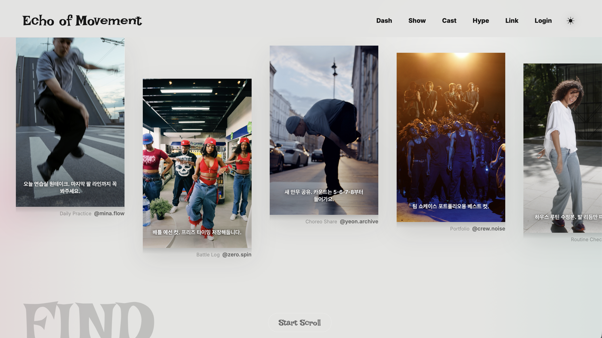

## 댄서들의 활동을 한곳에

인스타그램, DM, 오픈채팅, 지인 추천에 흩어진 활동과 기회를 한곳에서 찾기 위해 만든 프로젝트다. SHOW·CAST·HYPE·LINK 보드로 게시글을 나누고, 로그인 후 대시보드와 개인 활동 기록을 연다. React API 서버가 아니라 Spring MVC와 Thymeleaf로 화면을 렌더링하는 웹 애플리케이션이다.

- SHOW: 포트폴리오·공연·연습·안무 기록
- CAST: 강사·댄서·크루·팀원·오디션 모집
- HYPE: 배틀·워크숍·행사, 관리자 승인 행사 필터
- LINK: 연습 파트너·공간·네트워킹 정보

회원가입·로그인, 게시글 작성/수정/삭제, 댓글·좋아요·저장·신고, 검색·태그·정렬, 프로필과 포트폴리오 선택을 구현했다. 관리자는 사용자 차단, 게시글 숨김/복구, 행사 승인을 처리한다. 게시글 노출과 POST 액션에서도 숨김·차단 상태를 검사한다.

이미지·영상은 서버가 Cloudinary에 업로드하고 URL을 DB에 저장한다. Instagram은 링크 카드로 열며 실제 embed는 구현하지 않았다.

## 주요 화면

데스크톱에서는 콘텐츠가 보이는 구간을, 모바일에서는 좁은 화면에 맞춰 쌓인 목록과 게시글을 캡처했다.

### 랜딩 페이지 · 탭 전환

SHOW·CAST·HYPE·LINK 탭을 선택하면 소개 카드와 설명이 전환된다. 아래는 SHOW 카드와 스크롤 영상 연출이다.

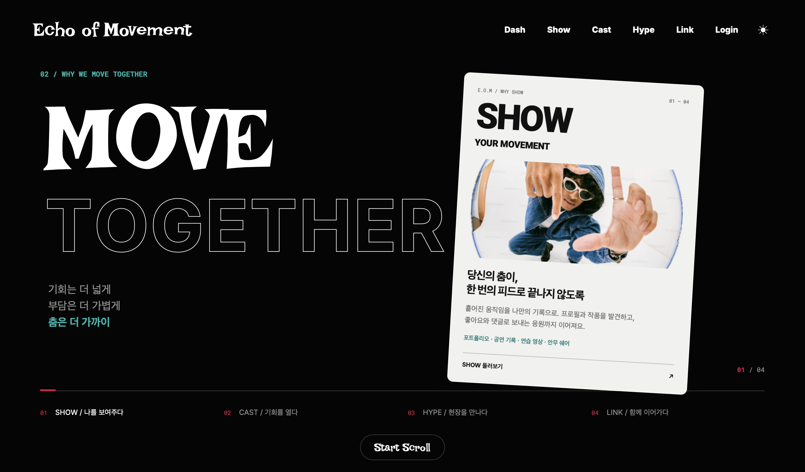

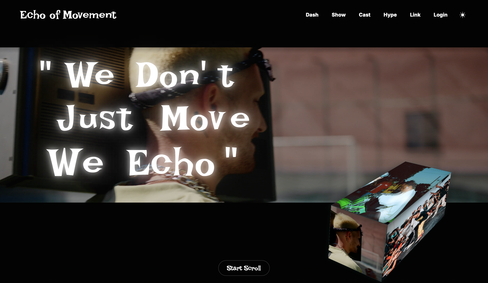

### 대시보드 · 인기 글과 최근 활동

인기 게시글, 태그, 활동, 행사와 최근 글을 한 화면에서 탐색한다.

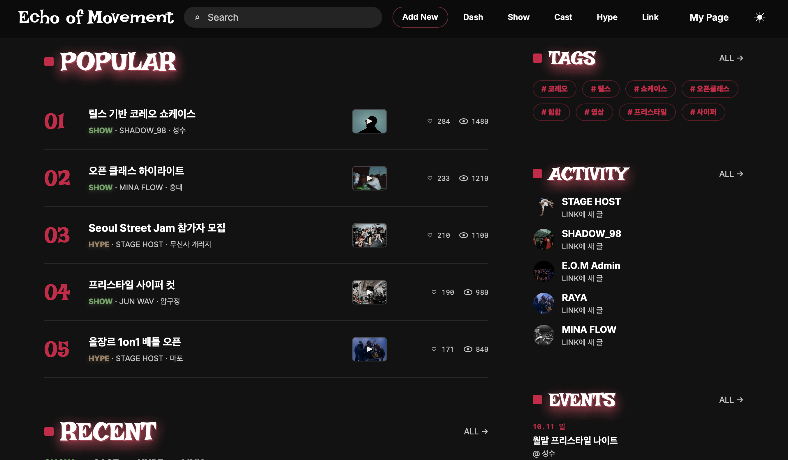

### 게시글 상세 · 콘텐츠와 참여

게시글 미디어와 본문, 관련 글을 함께 볼 수 있다.

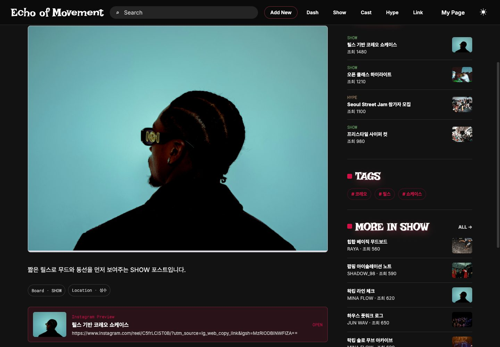

본문 아래에는 Instagram 링크 카드, 좋아요·저장과 댓글 입력이 이어진다.

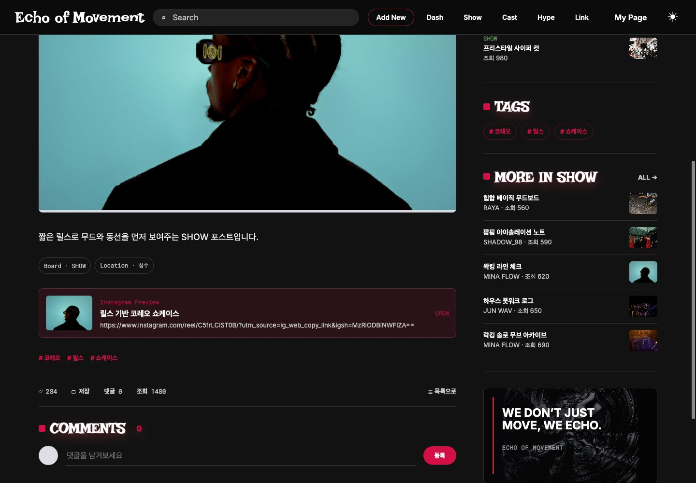

### 마이페이지 · 포트폴리오

선택한 작품과 최근 활동을 한 화면에서 확인한다.

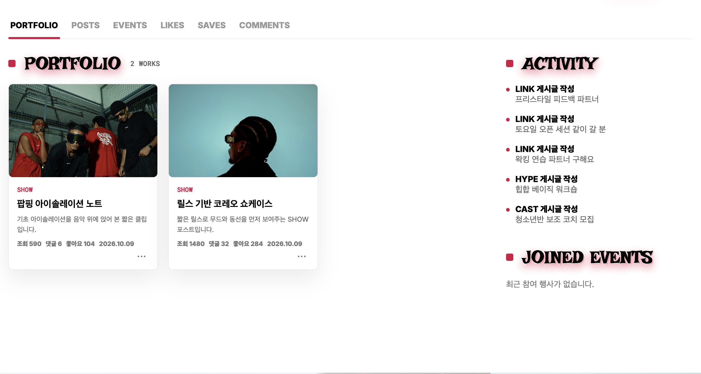

### 게시판과 글쓰기

게시판은 정렬과 보드별 탐색을 지원하고, 작성 폼은 입력한 내용을 오른쪽 미리보기에 반영한다.

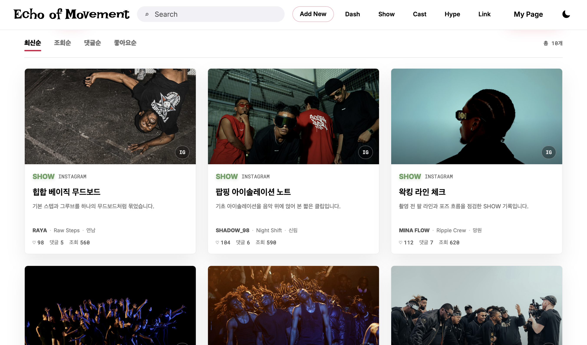

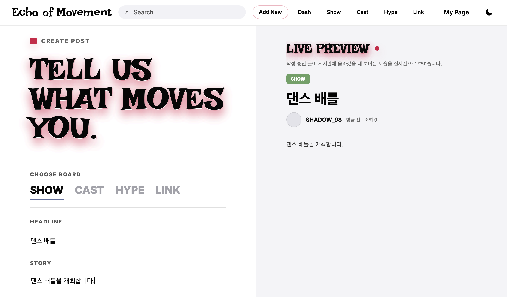

### 모바일 화면 · 430 × 932

게시판 카드, 대시보드의 인기 글, 게시글 본문이 모바일 너비에서 한 열로 배치된다.

| SHOW 게시판 | 대시보드 | 게시글 상세 |
|---|---|---|
| 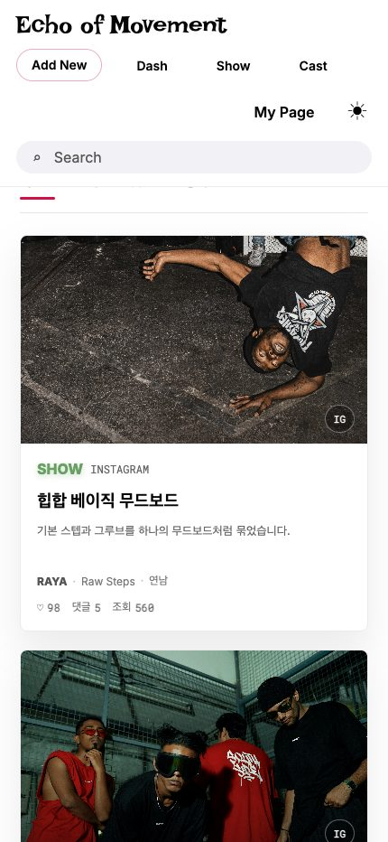 | 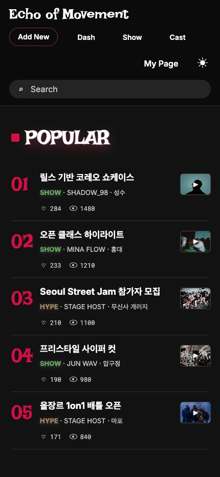 | 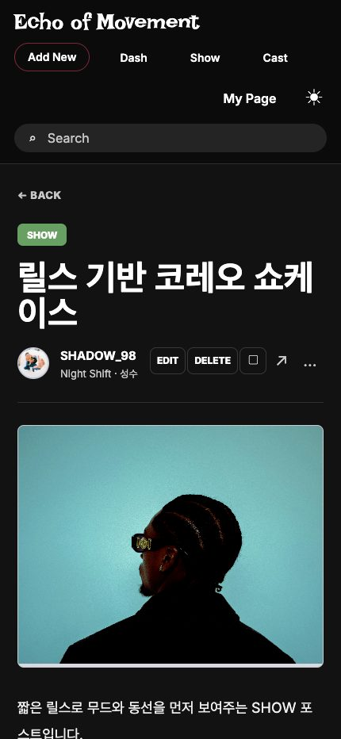 |

### 관리자 대시보드 · 화이트 테마

Moderation Room에서 신고 게시글, 사용자 역할·차단 상태, 게시글 공개 상태와 HYPE 행사 승인 여부를 확인한다. 사용자 차단·해제, 게시글 숨김·복구, 행사 승인·취소 액션을 각 목록에 배치했다.

| 사용자 관리 · 화이트 테마 | 게시글 관리 · 화이트 테마 · HYPE 행사 승인 |
|---|---|
| 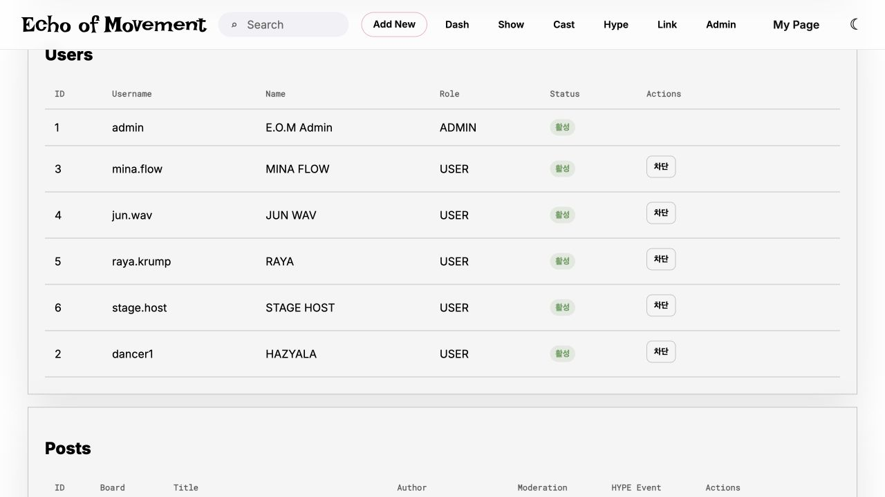 | 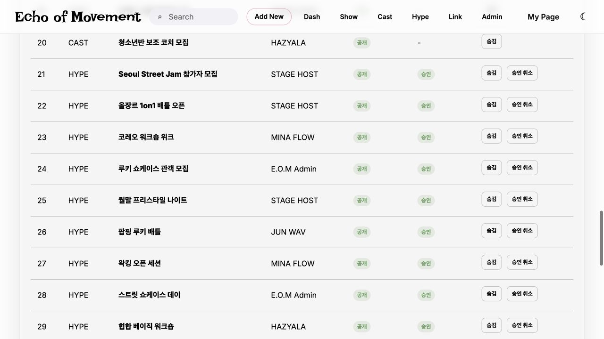 |

[관리자 대시보드 전체 화면 · 화이트 테마](docs/images/admin-dashboard.jpg)

<details>
<summary>게시글 상세 · 랜딩 · 로그인 화면</summary>

### 게시글 상세 · 화이트 테마

본문과 미디어, 작성자 프로필, 태그, 댓글·좋아요·저장 동작을 한 화면에 배치했다.

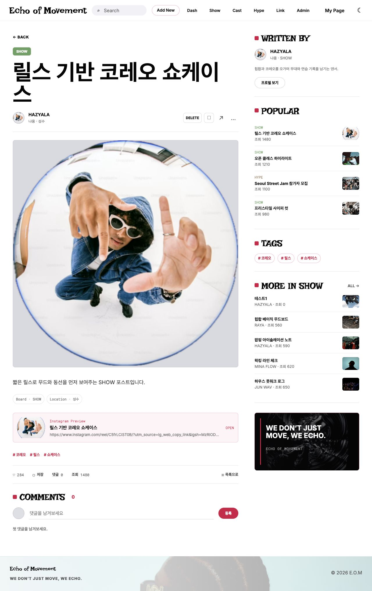

### 랜딩 · 다크 테마

SHOW·CAST·HYPE·LINK의 주제를 소개하고 로그인으로 연결한다.


### 로그인 · 다크 테마

로그인·회원가입 화면과 데모 계정 안내.

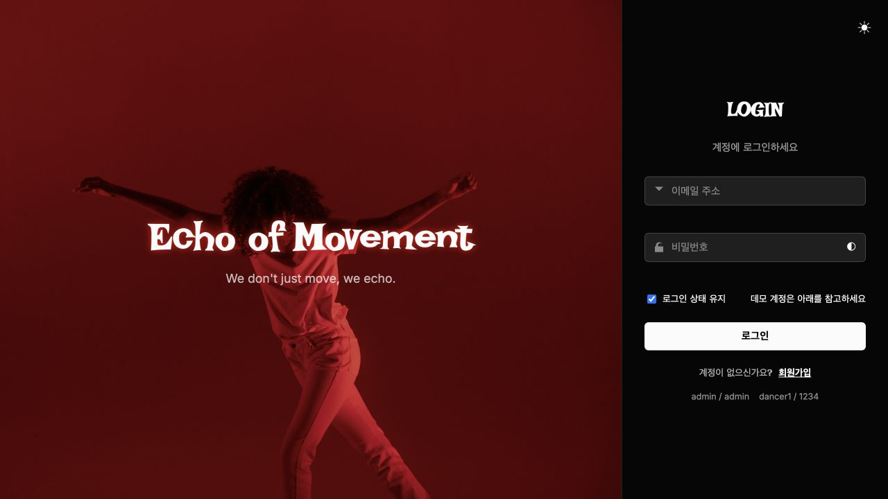

</details>

## 화면과 데이터의 연결

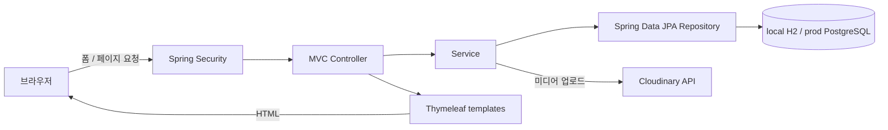

Controller는 요청·폼 오류·리다이렉트를 처리하고 Service는 권한과 도메인 규칙을 검사한다. JPA가 사용자·게시글·댓글·반응·참여 행사 관계를 저장한다. [상세 아키텍처](docs/ARCHITECTURE.md)에 데이터 관계와 공개 범위 검사를 정리했다.

## 기술과 구조

| 역할 | 기술 |
|---|---|
| 서버 | Java 21, Spring Boot 3.3.13, Spring MVC |
| 화면 | Thymeleaf, CSS, 브라우저 JavaScript |
| 인증·검증 | Spring Security, BCrypt, Bean Validation |
| 저장 | Spring Data JPA, local H2 / prod PostgreSQL |
| 외부 미디어 | Spring RestClient로 Cloudinary HTTP API 호출 |
| 빌드·검증 | Gradle wrapper, Spring Boot Test, Security Test |

```text
src/main/java/polytech/aisw/eom/
├── controller/    페이지와 폼 요청
├── service/       권한·게시글·프로필·업로드 처리
├── repository/    JPA 조회와 저장
├── domain/        엔티티와 enum
├── dto/           게시글·댓글 입력 폼
├── config/        인증·multipart 설정
├── security/      사용자 인증 데이터 로딩
└── init/          초기 샘플 데이터
src/main/resources/
├── templates/     Thymeleaf 화면
└── static/        CSS, JS, 기존 이미지
```

## 실행과 확인

JDK 21을 사용한다. 루트의 wrapper로 실행한다.

```bash
bash gradlew bootRun
```

기본 local profile은 `http://localhost:8080`에서 메모리 H2를 사용한다. H2 console은 `/h2-console`이며 DB URL은 `application.yml`의 local 값을 사용한다. `DataSeeder`의 샘플 계정은 `admin / admin`, `dancer1 / 1234`다. local `create-drop` 설정이므로 종료 후 데이터가 유지되는 환경이 아니다.

`build.gradle`에 Maven Central이 설정되어 있어 처음 실행하는 컴퓨터에서도 필요한 의존성을 받을 수 있다. 첫 실행에는 인터넷 연결이 필요하다.

```bash
bash gradlew test
bash gradlew bootJar
```

기존 테스트는 `src/test/`에서 확인한다. 환경변수, Cloudinary 파일 제한, prod DB, JAR·Docker 실행은 [운영 안내](docs/RUNNING.md)에 분리했다. `main`에는 Java 21 multi-stage [Dockerfile](Dockerfile)이 있다.

## 요청 인터페이스

| Method | Path | 역할 |
|---|---|---|
| GET | `/dashboard` | 로그인 후 보드·추천·최근 활동 |
| GET | `/boards/{board}`, `/posts` | 보드·검색·태그·정렬 |
| GET / POST | `/posts/new` | 작성 폼 / 게시글 저장 |
| GET | `/posts/{id}` | 상세·댓글·반응 |
| POST | `/posts/{id}/like`, `/posts/{id}/save` | 좋아요·저장 토글 |
| GET | `/my-page`, `/admin` | 내 정보 / 관리자 화면 |

이 경로들은 JSON REST 계약이 아니라 HTML·폼 중심이다. 인증·CSRF·필드·전체 endpoint는 [API / HTTP 문서](docs/API.md)를 본다.
