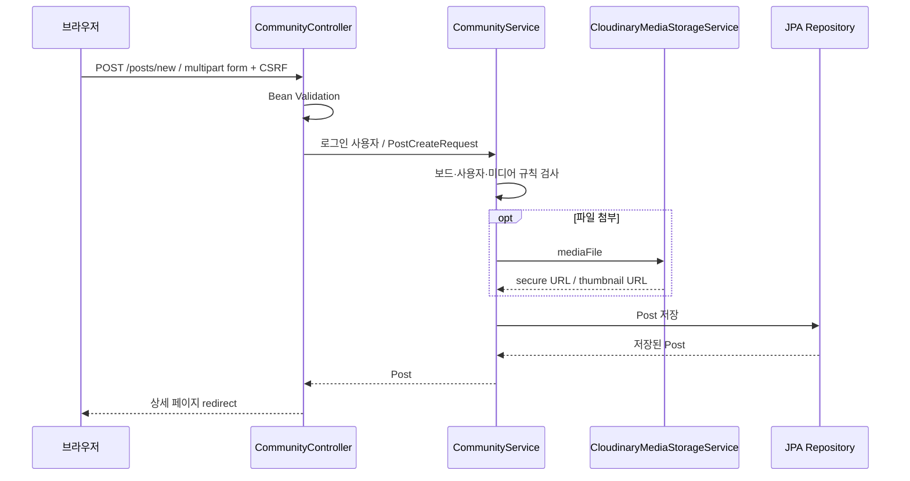

# E.O.M 요청과 저장 구조

## 서버 렌더링

Spring Security가 인증을 처리하고 MVC Controller가 Service 결과를 Model에 넣어 Thymeleaf view를 반환한다. `CommunityController`는 보드·검색·상세·작성·반응, `MyPageController`는 프로필·계정·포트폴리오·참여 행사, `AdminController`는 운영 액션을 맡는다.

폼 오류와 업로드 실패는 작성 화면에 되돌려 표시한다. DB row와 외부 파일 업로드는 서로 다른 시스템의 작업이며 단일 원자적 트랜잭션이라고 설명하지 않는다.

## 도메인 관계

`AppUser`는 게시글 작성자, 댓글 작성자, 좋아요·저장 주체와 연결된다. `Post`에는 boardType, 본문·태그·위치·미디어·행사 일자, 숨김/신고/승인/포트폴리오 관련 상태가 있다. `Comment`, `PostLike`, `PostSave`가 사용자와 게시글을 잇는다. `JoinedEvent`는 사용자가 입력한 행사 참여 기록이다.

- `CommunityService`와 Repository는 숨김 게시글·차단 작성자 노출을 걸러낸다.
- 수정/삭제는 로그인만으로 허용하지 않고 작성자·관리자 조건을 검사한다.
- 관리자 승인 행사 필터는 HYPE의 `adminApprovedEvent` 상태를 사용한다.
- `DashboardService`는 여러 조회 결과를 대시보드 섹션으로 묶는다.
- `CloudinaryMediaStorageService`는 RestClient multipart 요청과 서명 생성으로 업로드한다. 전용 Cloudinary SDK 의존성은 없다.

## 인증과 profile

`SecurityConfig`는 홈·로그인·회원가입·정적 리소스·H2 console을 허용하고 `/admin/**`를 ADMIN으로 제한한다. 나머지 페이지에는 로그인이 필요하다. BCrypt로 비밀번호를 저장하고 form login, 세션, remember-me cookie를 사용한다. CSRF 예외는 H2 console이며 일반 POST 폼은 token이 필요하다.

local profile은 H2 `create-drop`, prod는 PostgreSQL `update`다. 스키마 migration 도구가 선언된 프로젝트는 아니다. 실행 환경은 [RUNNING](RUNNING.md), 요청 계약은 [API](API.md)에서 확인한다.

## 코드 근거

[Controller](../src/main/java/polytech/aisw/eom/controller/) · [Service](../src/main/java/polytech/aisw/eom/service/) · [Domain](../src/main/java/polytech/aisw/eom/domain/) · [Repository](../src/main/java/polytech/aisw/eom/repository/) · [SecurityConfig](../src/main/java/polytech/aisw/eom/config/SecurityConfig.java)
